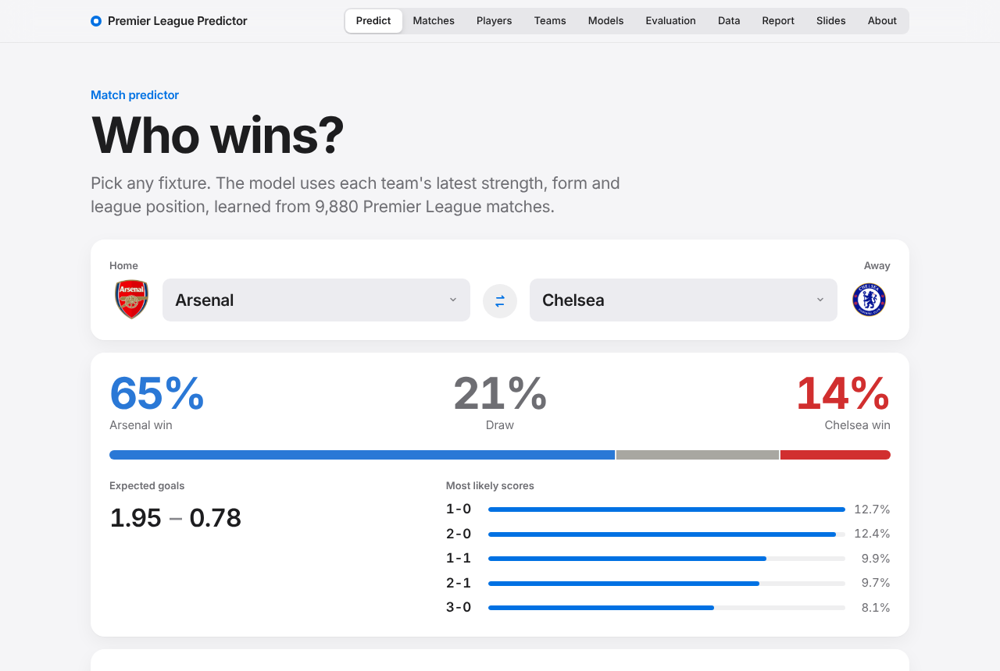
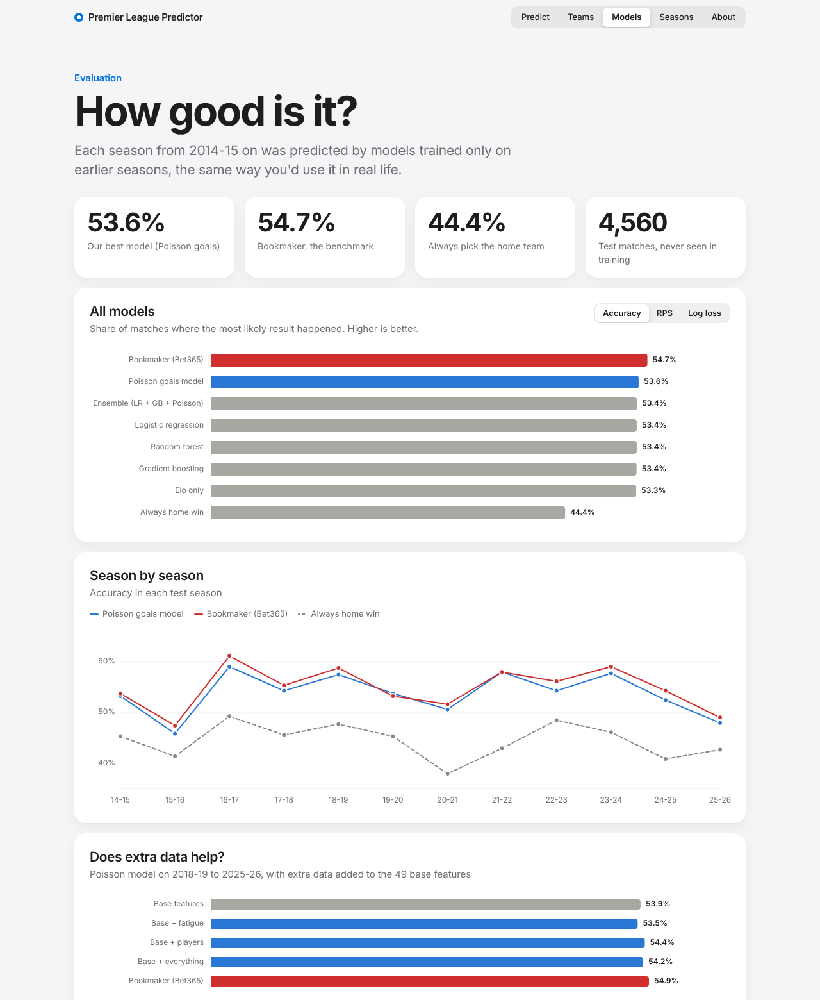
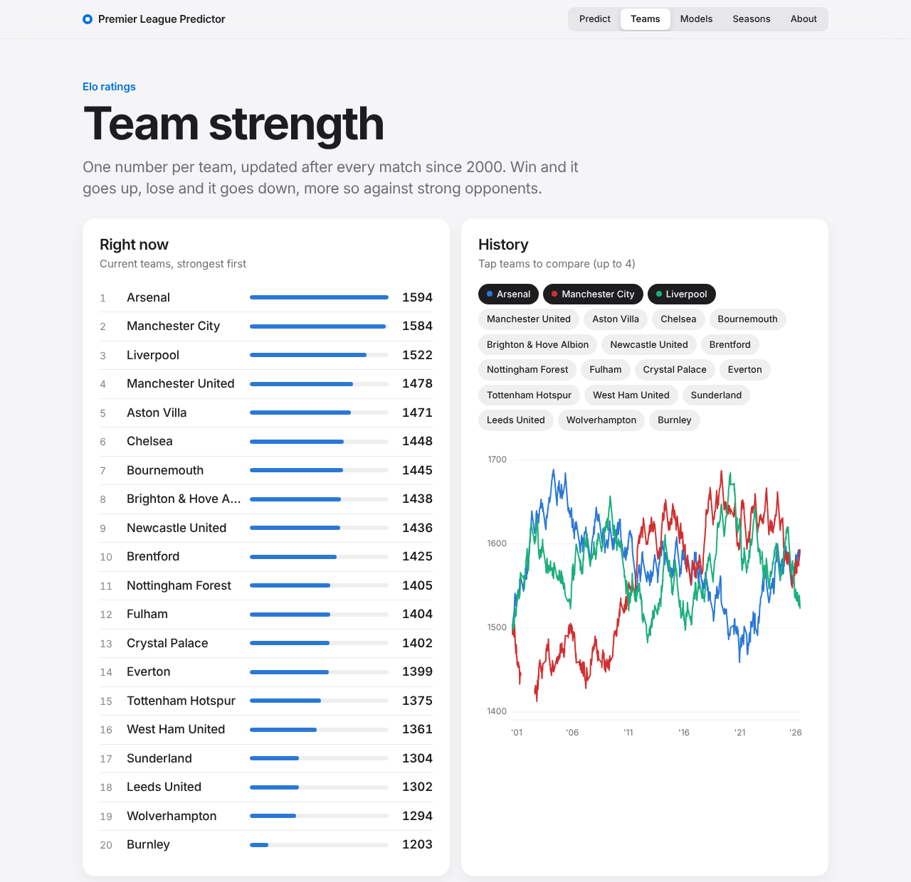
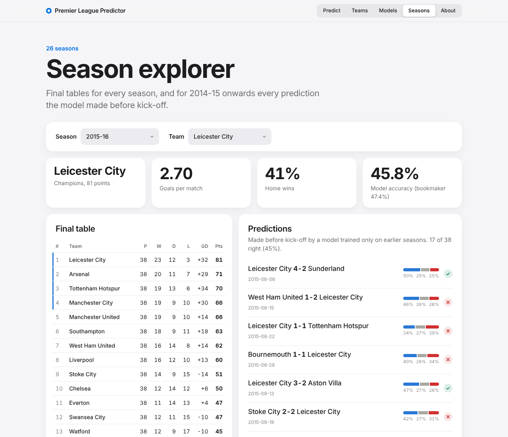
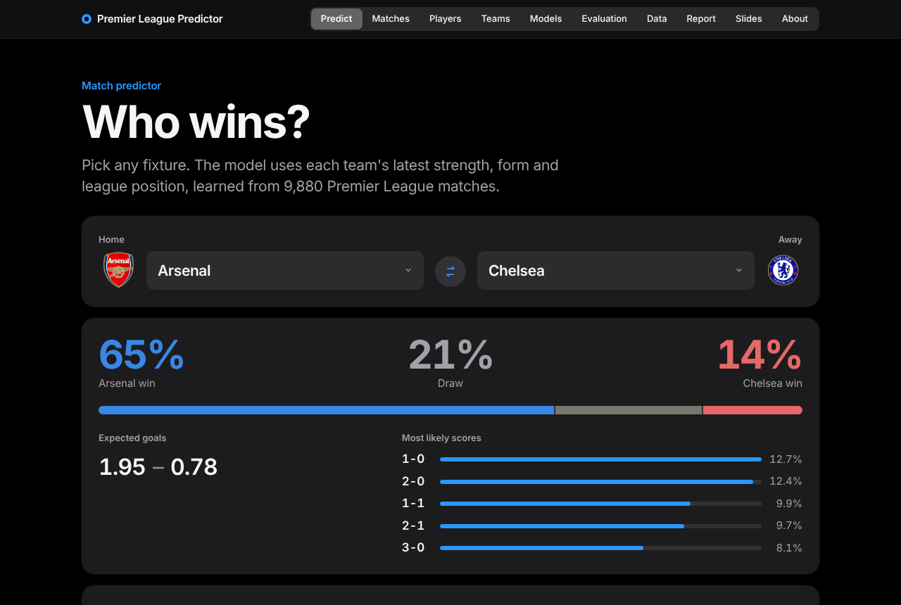
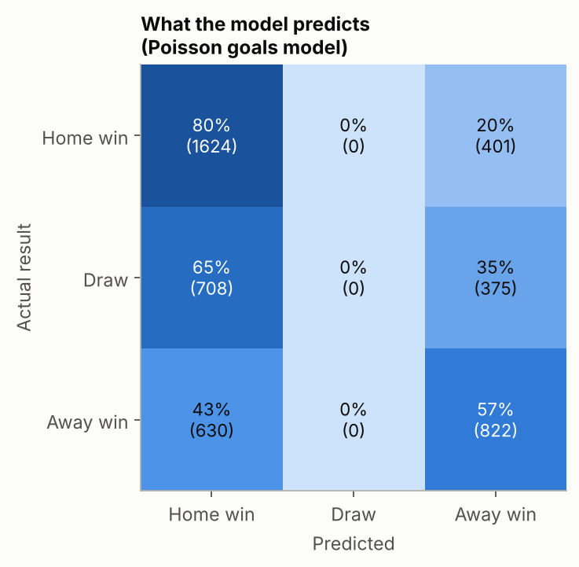
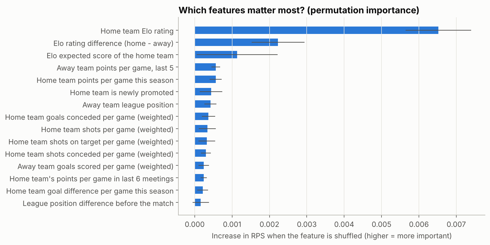
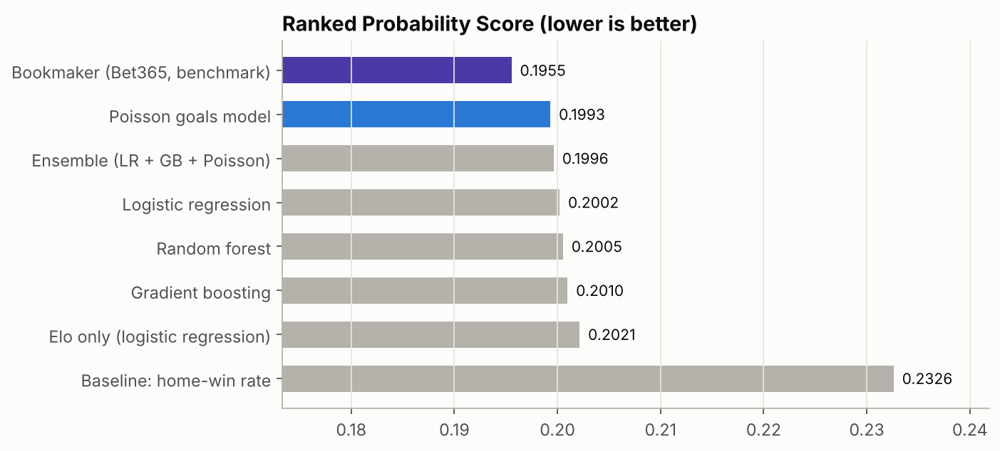

# Premier League match prediction (2000/01 – 2025/26)

Predicting the probability of a **home win, draw or away win** for English Premier League matches, using only information available **before kick-off**.

This is version 2 of [premier-league-prediction-2019-2020](https://github.com/salxz696969/premier-league-prediction-2019-2020), rebuilt from scratch with:

* **26 seasons of real data**: 9,880 matches instead of part of one season, with no generated data
* **Leakage-safe features**: Elo ratings, form, league table, rest days and head-to-head, all computed from past matches only and checked by an automated test
* **Honest evaluation**: walk-forward testing on 12 full seasons (4,560 matches the models never saw)
* **A professional benchmark**: our models are compared with bookmaker odds
* **Sources for everything**, listed in [`SOURCES.md`](SOURCES.md)
* **A web app to show it all**: predictor, team ratings, model results and a season explorer

---

## The app

```bash
uv sync
uv run python app.py          # opens http://127.0.0.1:8000 in your browser
```

It runs on your own computer and needs no internet connection, so it's safe for a live demo. It has five sections:

| Section | What it shows |
|---|---|
| **Predict** | Pick any two current teams: win/draw/loss probabilities, expected goals, the 5 most likely scores, and *why* (Elo, form, position and goals side by side) |
| **Teams** | Current Elo ranking, plus Elo history since 2000 for up to 4 teams (hover for values) |
| **Models** | Every model vs the bookmaker and the baseline (accuracy, RPS, log loss), season-by-season accuracy, feature importance, the draw problem, calibration, and version 1 vs version 2 |
| **Seasons** | Final table of any season from 2000-01; for 2014-15 onwards, every pre-match prediction with ✓/✗, filterable by team (try Leicester 2015-16) |
| **About** | The method in four steps, plus sources |



<details>
<summary><b>More screenshots</b> (models, teams, seasons, dark mode)</summary>






</details>

The design follows Apple's interface guidelines (via the [apple-design skill](https://github.com/emilkowalski/skills)): system font, translucent navigation bar, instant press feedback, smooth non-bouncy motion, light/dark mode, and gentler versions for the reduced-motion, reduced-transparency and high-contrast settings. The frontend uses plain HTML/CSS/JavaScript, with charts drawn as SVG and no outside libraries. Python serves it through Waitress.

---

## Results at a glance

Each season from 2014-15 to 2025-26 is predicted by models trained **only on earlier seasons**.

| Model | Accuracy | RPS ↓ | Log loss ↓ |
|---|---:|---:|---:|
| Bookmaker (Bet365), *benchmark only* | 54.7 % | 0.1955 | 0.961 |
| **Poisson goals model** (our best) | **53.6 %** | **0.1993** | **0.972** |
| Ensemble (LR + GB + Poisson) | 53.4 % | 0.1996 | 0.974 |
| Logistic regression | 53.4 % | 0.2002 | 0.978 |
| Random forest | 53.4 % | 0.2005 | 0.978 |
| Gradient boosting | 53.4 % | 0.2010 | 0.981 |
| Elo rating only | 53.3 % | 0.2021 | 0.982 |
| Baseline: always "home win" | 44.4 % | 0.2326 | 1.069 |

*RPS = Ranked Probability Score, the standard metric for football forecasts (lower is better). Full table: [`reports/results_overall.csv`](reports/results_overall.csv).*


**Key findings**

1. **All models clearly beat the baseline** (53–54 % vs 44 %) and get within about 1 percentage point of the bookmaker, who has extra information we don't have (injuries, line-ups, news).
2. **Team strength is most of the story.** A single feature, the Elo rating, already reaches 53.3 %. The other 48 features add a little more.
3. **The simple classic model wins.** A Poisson model of goals (Maher, 1982) beat random forest and gradient boosting. More complex isn't automatically better.
4. **Draws are basically unpredictable.** About 25 % of matches are draws, but a draw is almost never the *most likely* outcome, so our models almost never pick one (under 1 % of matches) and the bookmaker never does.
5. **The probabilities are honest** (well calibrated): when the model says 60 %, it happens about 60 % of the time.


Interesting seasons: **2015-16** (Leicester City won the league as 5000-1 outsiders, the hardest season for the models and the bookmaker) and **2020-21** (no fans because of COVID-19: the only season of the 26 where away teams won more often than home teams).

<details>
<summary><b>More figures</b> (calibration, confusion matrix, feature importance, Elo history)</summary>








</details>

---

## What changed from version 1

| | Version 1 | Version 2 (this repo) |
|---|---|---|
| Data | 2019-20 only (288 matches; data stops in March 2020) | 26 complete seasons, 9,880 matches |
| Extra data | ~2,500 generated rows that aren't real matches (e.g. "matchday 50", matches in July 2016) | None; every match is real |
| Data source | Mixed, partly manual cleaning | Football-Data.co.uk, downloaded and checked by a script |
| Leakage | League position "after 20 games" used for every match | Every feature uses only earlier matches, and an automated test checks it |
| Test set | 38 matches | 4,560 matches (12 seasons, walk-forward) |
| Metrics | Accuracy | Accuracy, log loss, Brier score, RPS, calibration |
| Benchmark | None | Home-win baseline + bookmaker odds |
| Code | Notebooks with hard-coded paths (`/mnt/d/...`) | Python package + numbered scripts + tests; runs on any computer |

On the original 38 test matches, every new model scores 55–58 % against the original 47.5 %. But on so few matches even "always pick the home team" scores 57.9 %. That's exactly why a much bigger test set was needed ([figure](reports/figures/season_2019_20_vs_original.png)).

---

## How it works

```
data/raw/  ──1──▶  matches.csv  ──2──▶  features.csv  ──3──▶  predictions + results  ──4──▶  figures
 (download)        (clean, check)       (pre-match only)      (walk-forward test)
```

### 1. Data ([`src/eplpred/data.py`](src/eplpred/data.py))
* Results and match statistics (shots, shots on target, corners, fouls, cards) for every match, from **Football-Data.co.uk**.
* Bet365 odds, converted to probabilities with the bookmaker's margin removed. These are **only used as a benchmark** and are never given to the models.
* Automatic checks: 380 matches per season, no duplicates, every result agrees with the score.

### 2. Features ([`src/eplpred/features.py`](src/eplpred/features.py), [`src/eplpred/elo.py`](src/eplpred/elo.py))
49 features, all computed from matches **before** the one being predicted:

| Family | Features |
|---|---|
| **Elo rating** | Strength rating updated after every match (own implementation: home advantage, goal-difference multiplier, regression to the mean between seasons, promoted teams start at the level of the relegated ones) |
| **Recent form** | Points per game in the last 5 matches, and in the last 5 home (or away) matches |
| **Weighted averages** | Goals, shots, shots on target, corners for and against, share of shots on target (recent games count more) |
| **Season so far** | Points per game, goal difference per game, league position before the match |
| **Last season** | Final position, newly promoted or not |
| **Other** | Rest days, head-to-head record (last 6 meetings), matchweek, home–away differences |

`tests/test_no_leakage.py` changes the results of one day's matches and checks that **no feature on or before that day changes**. If any feature secretly used the result, the test would fail.

### 3. Models ([`src/eplpred/models.py`](src/eplpred/models.py))
Baseline (home-win rate) · Elo only · Logistic regression · Random forest · Gradient boosting · Poisson goals model · Ensemble.
All models output **probabilities** for H/D/A. Settings were tuned on seasons 2010-11 to 2013-14 only, before the test period ([`reports/tuning_log.txt`](reports/tuning_log.txt)).

### 4. Evaluation ([`src/eplpred/evaluation.py`](src/eplpred/evaluation.py))
**Walk-forward:** to predict season *S*, train on all seasons before *S*. This is how prediction works in real life, where you only ever know the past. Scored with accuracy, log loss, Brier score and RPS.

---

## Run it yourself

Requirements: Python 3.11+ and [uv](https://docs.astral.sh/uv/) (or pip).

```bash
uv sync                                      # install everything

uv run python scripts/run_all.py             # whole pipeline, a few minutes
#   or step by step:
uv run python scripts/01_download_data.py    # raw CSVs -> data/processed/matches.csv
uv run python scripts/02_build_features.py   # -> data/processed/features.csv
uv run python scripts/03_evaluate_models.py  # walk-forward test -> reports/*.csv
uv run python scripts/04_make_figures.py     # -> reports/figures/*.png

uv run pytest                                # tests (incl. the leakage test)
```

**Predict a match** (uses each team's latest Elo, form and position):

```bash
uv run python scripts/predict_match.py "Arsenal" "Chelsea"
```
```
Arsenal vs Chelsea
  Home win :  67.4%
  Draw     :  19.7%
  Away win :  13.0%
  Expected goals: 2.07 - 0.78 (most likely score 2-0)
```

**Web app:** `uv run python app.py` (see [The app](#the-app) above). Add `--port 8080` to change the port or `--no-browser` to stop it opening a browser tab.

**Walkthrough notebook:** [`notebooks/walkthrough.ipynb`](notebooks/walkthrough.ipynb) tells the whole story with outputs already included, in the presentation order below.

Without uv: `pip install -e . pytest`, then run the same `python app.py` / `python scripts/...` commands.

---

## Presenting this project (suggested order)

1. **Question:** can we predict a match before kick-off? Why it's hard (football is low-scoring and random).
2. **Data:** 26 seasons, 9,880 matches, from Football-Data.co.uk → `outcomes_by_season.png` (home advantage, COVID season).
3. **Features without cheating:** explain leakage and how the test checks for it; show `elo_history.png`.
4. **Fair testing:** walk-forward by season, and why 38 test matches are not enough → `season_2019_20_vs_original.png`.
5. **Results:** `model_accuracy.png`, `accuracy_by_season.png`: best model vs bookmaker vs baseline.
6. **Insights:** Elo carries most of the signal (`feature_importance.png`), draws are unpredictable (`confusion_matrix.png`), probabilities are calibrated (`calibration.png`).
7. **Live demo:** `python app.py`: predict a fixture the class suggests, then show Leicester 2015-16 in *Seasons*.
8. **Limitations and future work** (below), then **sources** (`SOURCES.md`).

---

## Limitations and ideas for future work

* **No team news.** Injuries, suspensions, line-ups and transfers are not in the data. This is the main reason the bookmaker is still better.
* **No expected goals (xG).** xG data would likely help, but free sources only start in 2014 and are hard to download reliably.
* **League matches only.** Cup and European matches are not included, so rest days ignore midweek cup games.
* **Draws.** Predicting draws remains an open problem for every model.
* **Ideas:** a Dixon–Coles low-score adjustment, xG-based features, player-level data, and simulating the rest of a season to predict the final table.

---

## Project structure

```
├── README.md                 ← you are here
├── SOURCES.md                ← data sources + academic references
├── app.py                    ← starts the web app
├── docs/screenshots/         ← screenshots of the app
├── data/
│   ├── raw/                  ← downloaded files, unchanged (football-data/, odds/)
│   └── processed/            ← matches.csv (+ features.csv, rebuilt by step 2)
├── notebooks/walkthrough.ipynb
├── reports/
│   ├── figures/              ← all charts
│   ├── results_overall.csv   ← metrics per model
│   ├── results_by_season.csv ← metrics per model per season
│   ├── predictions.csv       ← every test prediction
│   ├── feature_importance.csv
│   └── tuning_log.txt        ← how the settings were chosen
├── scripts/                  ← 01_…04_ pipeline steps, run_all.py, predict_match.py, tune_models.py
├── src/eplpred/              ← the code (config, data, elo, features, models, evaluation, plots, predict)
│   └── web/                  ← the app: api.py (data), server.py (web server), static/ (HTML, CSS, JS)
└── tests/                    ← pytest tests (leakage, Elo, metrics, data, web app)
```

## Deployment and CI/CD

The app deploys to your VPS at `http://<VPS_IP>:8000`, without a domain.
See [deployment setup](deploy/README.md) for server preparation and GitHub secrets.
GitHub Actions runs tests and checks the Docker image on pull requests and pushes.
Successful pushes to `main` deploy that exact image over SSH; failed startup restores
the previous running image. Feature branches do not deploy.

## Data licence

Match data: Football-Data.co.uk, via the DataHub mirror (PDDL v1.0). Odds: Club Football Match Data by Adam Gábor (MIT). See [`SOURCES.md`](SOURCES.md) for full citations. This project is for education and research.
