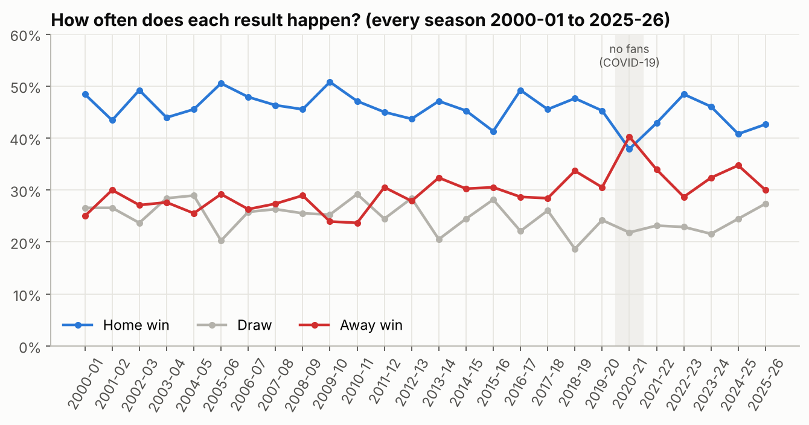
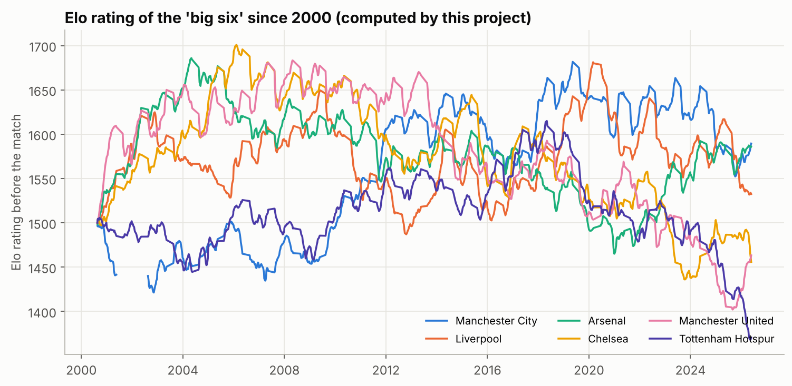
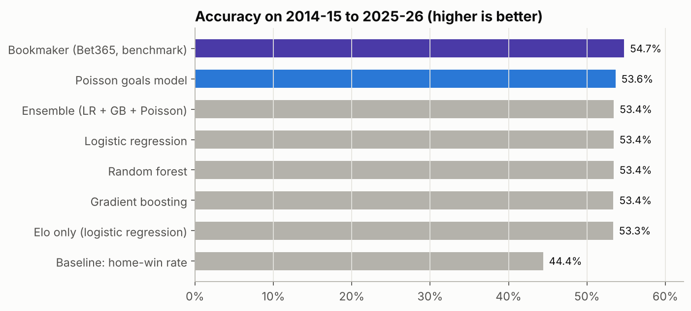
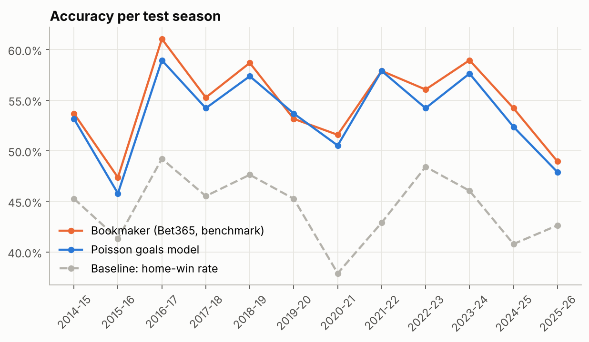
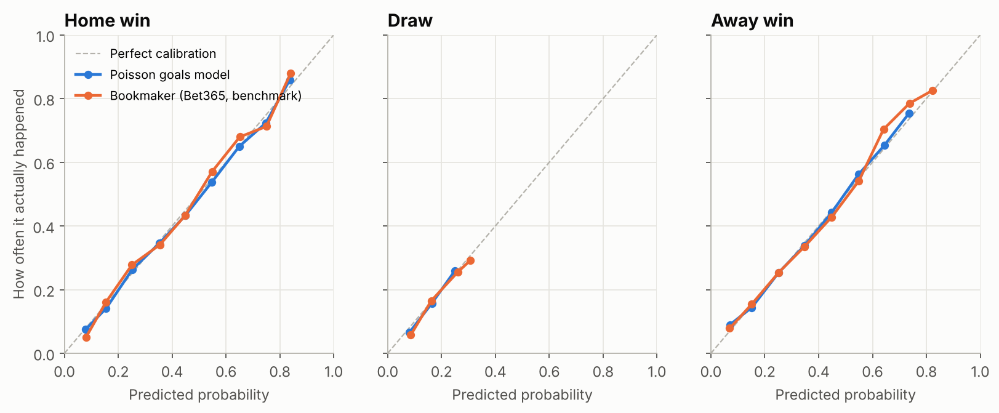
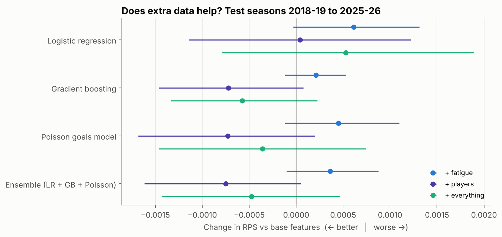

# Predicting Premier League match results

*Data science project report · generated automatically from the project's results on 2026-10-08*

## Summary

We built a model that predicts, before kick-off, the probability of a home win, a draw and an away win in English Premier League matches. We used **9,880 real matches from 26 seasons** (2000-01 to 2025-26), calculated every input only from earlier matches, and tested the models fairly on **4,560 matches they had never seen**.

The best model, a **Poisson goals model**, picked the right result in **53.6%** of test matches. That is far better than always picking the home team (44.4%) and close to a professional bookmaker (54.7%). Adding Fantasy Premier League player data improved it slightly; fatigue from cup and European matches did not help.

## 1. Introduction

Football is hard to predict: there are only about 2.7 goals per match, so luck plays a big role, and about a quarter of matches end in a draw. Our question was:

> **Before a match starts, how well can we estimate the chances of a home win, a draw and an away win?**

This is version 2 of our project. Version 1 used a single season, about 2,500 rows of generated (not real) data and information that was only known after kick-off, and it was tested on only 38 matches. Version 2 fixes all of these problems.

## 2. Data

All data comes from public datasets (full list with licences in `SOURCES.md`; every row can be browsed on the website's **Data** page).

| Data | Source | What we use |
|---|---|---|
| 9,880 Premier League matches, 2000-01 to 2025-26 | Football-Data.co.uk (via DataHub) | Scores, shots, shots on target, corners, fouls, cards |
| Bookmaker odds (98% of matches) | Bet365, via Club Football Match Data | Only as a benchmark, never as an input |
| 253,781 player-match rows, 2016-17 onwards | Fantasy Premier League (Vaastav Anand) | Starting eleven, player influence |
| 4,207 cup and European matches | engsoccerdata, openfootball | Fatigue (match dates) |
| 25,244 international matches | martj42/international_results | International breaks |

The download script checks the data automatically: every season has exactly 380 matches, there are no duplicates, and every result agrees with its score. Coverage of the other competitions:

| Competition | Coverage |
|---|---|
| FA Cup | 25 of 26 seasons |
| League Cup | 25 of 26 seasons |
| Champions League | 26 of 26 seasons |
| Europa League | 5 of 26 seasons |

Home teams won 45.7% of all matches, 24.8% were draws and 29.5% away wins. In 2020-21, played without fans because of COVID-19, away teams won more often than home teams (40.3% vs 37.9%): home advantage largely comes from the crowd.

## 3. Method

### 3.1 No cheating: only information from before kick-off

The most important rule is to avoid **data leakage**: using information that is only known after the match starts, such as the shots in that match. Leakage gives impressive but fake results. Every input in this project is calculated from **earlier matches only**, and an automatic test (`tests/test_no_leakage.py`) changes the results of one day's matches and checks that no input on or before that day changes.

### 3.2 Inputs (features)

The model uses 49 inputs per match, plus player features from 2016-17:

- **Elo rating**: one number for a team's strength, updated after every match. The expected score of the home team is `1 / (1 + 10^(−(home rating + 50 − away rating) / 400))`, where 50 is the home advantage.
- **Recent form**: points per game in the last 5 matches, and in the last 5 home (or away) matches.
- **Attack and defence**: goals, shots, shots on target and corners for and against, with recent matches counting more.
- **League table**: current position, points per game and goal difference this season; last season's position or "promoted".
- **Other**: rest days, head-to-head record, matchweek.
- **Players (2016-17 onwards)**: the strength of the expected starting eleven, measured by each player's Fantasy Premier League *influence* per 90 minutes in his previous 15 games, plus how many of the team's five most influential players are not starting.

### 3.3 Models

| Model | In simple words |
|---|---|
| Always home win | The baseline: always predicts the most common result |
| Elo only | Uses only the Elo rating difference |
| Logistic regression | A weighted sum of all inputs, turned into probabilities |
| Random forest | 500 decision trees that vote |
| Gradient boosting | Small trees added one by one, each fixing earlier mistakes |
| Poisson goals model | Predicts each team's goals, then turns goals into results |
| Ensemble | The average of logistic regression, gradient boosting and Poisson |

Model settings were chosen using only the seasons 2010-11 to 2013-14 (`reports/tuning_log.txt`), never the test seasons.

### 3.4 Fair testing: walk-forward

To predict a season, a model is trained on all seasons before it and then predicts all 380 matches of that season. This was repeated for 12 seasons (2014-15 to 2025-26), giving 4,560 honest predictions. This copies real life: you can only learn from the past.

## 4. How one prediction is calculated

Example: **Arsenal vs Chelsea**, using the final model and each team's latest data.

**Step 1, expected goals.** In an average match the home team scores 1.47 goals and the away team 1.13. Each input multiplies this up or down depending on how unusual it is. The biggest effects on Arsenal's goals:

| Input | Arsenal vs Chelsea | Average | Effect |
|---|---:|---:|---:|
| Elo expected score of the home team | 0.76 | 0.56 | ×1.091 |
| Home team Elo rating | 1593.49 | 1459.41 | ×1.086 |
| Elo rating difference (home - away) | 145.98 | -0.24 | ×1.071 |
| Home team points per game (weighted) | 2.50 | 1.36 | ×0.956 |
| Away top-5 players not starting | 0.00 | 0.99 | ×0.957 |
| Away team shots on target per game (weighted) | 3.07 | 5.35 | ×1.043 |

Result: **Arsenal 1.95 expected goals, Chelsea 0.78.**

**Step 2, Poisson distribution.** If a team is expected to score λ goals, the chance of exactly *k* goals is `λ^k × e^(−λ) / k!`. For example, the chance that Arsenal score exactly 2 is 27.0%.

**Step 3, add up the scores.** The chance of each exact score is the home chance times the away chance. Adding all scores where Arsenal score more gives **Arsenal win 64.9%**, the draws give **20.9%**, and the rest **Chelsea win 14.2%**. The website's Predict page shows every number of this calculation for any fixture.

## 5. How we measure accuracy

| Measure | What it means | Better |
|---|---|---|
| Accuracy | Share of matches where the most likely result happened | Higher |
| Precision | When the model picks a result, how often it is right | Higher |
| Recall | Of all matches with that result, how many the model picked | Higher |
| F1 score | Combines precision and recall: `2 × P × R / (P + R)` | Higher |
| Log loss | Average of `−ln(probability given to what happened)`; punishes confident mistakes | Lower |
| Brier score | Squared difference between the probabilities and what happened | Lower |
| RPS | Like Brier, but on the ordered scale home win, draw, away win; the standard in football research (Constantinou & Fenton, 2012) | Lower |
| AUC | How well the probabilities separate matches with and without an outcome (0.5 = guessing) | Higher |
| Calibration | Whether "60%" really happens about 60% of the time | Close to the diagonal |

## 6. Results

### 6.1 All models (4,560 test matches, 2014-15 to 2025-26)

| Model | Accuracy | Log loss | Brier | RPS |
|---|---:|---:|---:|---:|
| Bookmaker (Bet365) | 54.7% | 0.961 | 0.569 | 0.1955 |
| Poisson goals model | 53.6% | 0.972 | 0.577 | 0.1993 |
| Ensemble (LR + GB + Poisson) | 53.4% | 0.974 | 0.579 | 0.1996 |
| Logistic regression | 53.4% | 0.978 | 0.581 | 0.2002 |
| Random forest | 53.4% | 0.978 | 0.581 | 0.2005 |
| Gradient boosting | 53.4% | 0.981 | 0.582 | 0.2010 |
| Elo only | 53.3% | 0.982 | 0.584 | 0.2021 |
| Always home win | 44.4% | 1.069 | 0.647 | 0.2326 |

All models clearly beat always picking the home team. The **Poisson goals model** was the best of ours on every probability score, and within about one percentage point of the bookmaker. The Elo rating alone already reaches 53.3%: team strength is most of the story. The most important inputs (permutation importance) were:

1. Home team Elo rating
2. Elo rating difference (home - away)
3. Elo expected score of the home team
4. Away team points per game, last 5
5. Home team points per game this season

### 6.2 Every season

The hardest season was 2015-16 (45.8%), when Leicester City won the league as 5000-1 outsiders; the easiest was 2016-17 (58.9%).

### 6.3 Detailed evaluation of the final model (3,040 matches, 2018-19 to 2025-26 (8 seasons))

| Outcome | Precision | Recall | F1 score | Matches |
|---|---:|---:|---:|---:|
| Home win | 0.555 | 0.796 | 0.654 | 1,336 |
| Draw | 0.000 | 0.000 | 0.000 | 700 |
| Away win | 0.525 | 0.589 | 0.555 | 1,004 |
| **Accuracy** | | | **0.544** | 3,040 |

Confusion matrix (rows: what happened; columns: what the model picked):

| | Picked home win | Picked draw | Picked away win |
|---|---:|---:|---:|
| **Home win** | 1,063 | 0 | 273 |
| **Draw** | 438 | 0 | 262 |
| **Away win** | 413 | 0 | 591 |

The accuracy is 54.4% (95% range 52.6% to 56.2%). Log loss 0.968, Brier 0.575, RPS 0.1998, AUC 0.670 (bookmaker on the same matches: 54.9%, log loss 0.959, RPS 0.1966; always home win: RPS 0.2349).

**The draw problem:** 23% of matches were draws, but a draw is almost never the single most likely result, so the model (like the bookmaker) practically never picks one, and draw recall is 0.00. The probabilities still include the draw chance, and they are well calibrated:

### 6.4 Does extra data help?

We added two kinds of extra data and tested them the same way on the seasons that have player data (2018-19 to 2025-26, 3,040 matches):

| Inputs | Accuracy | RPS (lower is better) |
|---|---:|---:|
| Base features | 53.9% | 0.2007 |
| + fatigue (cup, European and international match dates) | 53.5% | 0.2011 |
| + players (FPL starting-eleven strength) | 54.4% | 0.1998 |
| Bookmaker (benchmark) | 54.9% | 0.1966 |

**Player data helped a little; fatigue did not.** A likely reason is that the teams with the most midweek games are also the strongest teams, which the Elo rating already captures. The final model, used by the website, is therefore the Poisson model with the base features plus the player features.

### 6.5 Compared with version 1

On version 1's own 38 test matches every new model scores between 55% and 58%, against version 1's 47.5%. But always picking the home team also scores 57.9% on those matches: 38 matches are far too few to judge a model, which is why version 2 is tested on 4,560.

## 7. Discussion and limitations

- **Team news.** The model does not know about injuries, suspensions or confirmed line-ups (it assumes each team's usual eleven). This is the main reason the bookmaker is still slightly better.
- **Draws** remain almost impossible to pick as the single most likely result.
- **Missing data.** Europa League matches before 2020-21 and the 2025-26 domestic cups were not available from free sources; manager data is prepared in the code but not yet included.
- **Football is random.** Even professional bookmakers are right only about 55% of the time.

**Future work:** expected-goals (xG) data, manager changes, and simulating the rest of a season to predict the final league table.

## 8. Conclusion

With real data and an honest test, our best model predicts 53.6% of Premier League results correctly, far above the 44.4% baseline and close to the bookmaker's 54.7%. The most useful information is how strong each team is (Elo); a simple, well-understood Poisson model beat more complex machine-learning models; and testing fairly turned out to matter more than the choice of model.

## References

- Football-Data.co.uk (2026). England Premier League results and match statistics 2000/01–2025/26. Via DataHub football-datasets, https://github.com/datasets/football-datasets
- Anand, V. Fantasy-Premier-League historical data. https://github.com/vaastav/Fantasy-Premier-League
- Curley, J. engsoccerdata. https://github.com/jalapic/engsoccerdata · openfootball. https://github.com/openfootball
- Jürisoo, M. International football results. https://github.com/martj42/international_results
- Gábor, A. Club Football Match Data (2000–2025). https://github.com/xgabora/Club-Football-Match-Data-2000-2025
- Elo, A. E. (1978). *The Rating of Chessplayers, Past and Present*. Arco.
- Maher, M. J. (1982). Modelling association football scores. *Statistica Neerlandica*, 36(3), 109–118.
- Dixon, M. J., & Coles, S. G. (1997). Modelling association football scores and inefficiencies in the football betting market. *JRSS C*, 46(2), 265–280.
- Hvattum, L. M., & Arntzen, H. (2010). Using ELO ratings for match result prediction in association football. *International Journal of Forecasting*, 26(3), 460–470.
- Constantinou, A. C., & Fenton, N. E. (2012). Solving the problem of inadequate scoring rules for assessing probabilistic football forecast models. *JQAS*, 8(1).
- Pedregosa, F. et al. (2011). Scikit-learn: Machine learning in Python. *JMLR*, 12, 2825–2830.
